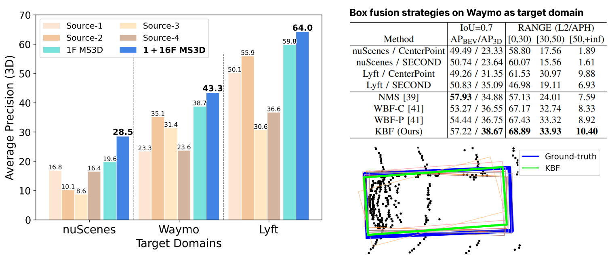

# MS3D
This is the official code release for **MS3D: Leveraging Multiple Source Domains for Unsupervised Domain Adaptation in 3D Object Detection**

MS3D is a framework to improve the performance of any 3D detector on an unseen dataset without requiring manual labelling. Our method does not require source-domain labels (i.e., source-free) and retains the original inference speed of the detector as we do not modify the detector architecture. 

## Introduction

Existing methods typically focus on adapting a single detector to the target domain, ignoring the fact that different detectors possess distinct expertise on different unseen domains. MS3D combines detectors from multiple source domains and temporal information to generate high-quality pseudo-labels for fine-tuning.

<p align="center">
  
</p>

By combining multiple detectors from different sources (Source 1-4), MS3D can always get higher quality pseudo-labels for fine-tuning any detector. We show that our KBF box fusion can outperform [Weighted Box Fusion (WBF)](https://github.com/ZFTurbo/Weighted-Boxes-Fusion), a popular box fusion method for 3D detector ensembling.
<p align="center">
  
</p>

## Overview
1. [Installation](docs/INSTALL.md)
2. [Dataset Preparation](docs/DATASET_PREPARATION.md)
3. [Getting Started](docs/GETTING_STARTED.md)
4. [Parameter Explanation](docs/PARAMETERS.md)
5. [Model Zoo](#model-zoo)
5. [Citation](#citation)

## Installation

Please refer to [INSTALL.md](docs/INSTALL.md) for the installation of MS3D.

## Getting Started

- Please refer to [Dataset Preparation](docs/DATASET_PREPARATION.md) to prepare the datasets. 
- Please refer to [GETTING_STARTED.md](docs/GETTING_STARTED.md) to learn more about how to use MS3D. We are also planning on releasing a guide for custom datasets, stay tuned!
- Please refer to [Parameter Explanation](docs/PARAMETERS.md) on a guide of how to tune MS3D parameters

## Model Zoo
For all tables below, "GT-FT" refers to fine-tuning the pre-trained detector using ground-truth labels from the target domain. If not stated in the table, the model used is SECOND-IoU. Results are reported at IoU=0.7 evaluated at 40 recall levels (R40).

### Target Domain: nuScenes

Models for target-nuscenes can be downloaded [here](https://drive.google.com/drive/folders/17KYsR6jfNm-erTwN2KvaeicrzUsZ1Vmi?usp=share_link). We also provide MS3D results for fine-tuning with multi-frame detection as is common on nuScenes models to demonstrate that we can further boost performance.
|Method           | Source | Vehicle (BEV) | Vehicle (3D) | 
| -----           | :-----:| :--------: | :-----: | 
| SN              | Waymo  | 33.23      | 18.57   | - |
| ST3D                                  | Waymo  | 35.92      | 20.19   | - |
| [MS3D](tools/cfgs/target-nuscenes/ft_waymo_secondiou.yaml)            | Waymo  | 42.23      | 24.76   | 
| [MS3D](tools/cfgs/target-nuscenes/ft_lyft_secondiou.yaml)            | Lyft   | 41.64      | 23.46   | 
| [MS3D (10 frame)](tools/cfgs/target-nuscenes/ft_waymo_secondiou_10frames.yaml) | Waymo  | 47.35      | 27.18   | 
| [GT-FT](tools/cfgs/target-nuscenes/ft_waymo_secondiou.yaml) | Waymo  | 44.39      | 29.46   | 
| [GT-FT (10 frame)](tools/cfgs/target-nuscenes/ft_waymo_secondiou_10frames.yaml) | Waymo  | 50.05      | 33.32   | 

### Target Domain: Lyft
Models for target-lyft can be downloaded [here](https://drive.google.com/drive/folders/1Cpd_OZv9F7_Np2Cdz3CINOnastXyY1y_?usp=share_link). Similarly to nuScenes we show multi-frame detection results for MS3D.
|Method           | Source | Vehicle (BEV) | Vehicle (3D) | 
| -----           | :-----:| :--------: | :-----: | 
| [SN](tools/cfgs/nuscenes_models/sn_lyft_uda_secondiou.yaml)             | nuScenes  | 63.11      | 39.60   | 
| [SN](tools/cfgs/waymo_models/sn_lyft_uda_secondiou.yaml)          | Waymo  | 71.61      | 56.13   | 
| [ST3D](tools/cfgs/target-lyft/st3d_nuscenes_secondiou.yaml)                                 | nuScenes  | 67.33      | 41.82   | 
| [ST3D](tools/cfgs/target-lyft/st3d_waymo_secondiou.yaml)                                   | Waymo  | 73.86      | 56.33   | 
| [MS3D](tools/cfgs/target-lyft/ft_nuscenes_secondiou.yaml)            | nuScenes   | 75.02      | 59.01   | 
| [MS3D](tools/cfgs/target-lyft/ft_waymo_secondiou.yaml)            | Waymo  | 77.05      | 60.17   | 
| [MS3D (3 frame)](tools/cfgs/target-lyft/ft_waymo_secondiou_multiframe.yaml)            | Waymo  | 76.89      | 63.12   | 
| [GT-FT](tools/cfgs/target-lyft/ft_waymo_secondiou.yaml) | Waymo  | 81.10      | 66.76   |
| [GT-FT (3 frame)](tools/cfgs/target-lyft/ft_waymo_secondiou_multiframe.yaml) | Waymo  | 83.58      | 69.44   | 


### Target Domain: Waymo

Due to the [Waymo Dataset License Agreement](https://waymo.com/open/terms/) we do not provide links to models that are trained on waymo data. You can train your own model using our provided configs.

If you want to download the models, please send me an email with your name, institute, a screenshot of the Waymo dataset registration confirmation mail and your intended usage. Please note that Waymo open dataset is under strict non-commercial license, so we are not allowed to share the model with you if it will use for any profit-oriented activities.

|Method           | Source | Vehicle (BEV) | Vehicle (3D) | 
| -----           | :-----:| :--------: | :-----: | 
| [SN](tools/cfgs/lyft_models/sn_waymo_uda_secondiou_vehicle.yaml)              | Lyft  | 53.39      | 39.22   | 
| [SN](tools/cfgs/nuscenes_models/sn_waymo_uda_secondiou_vehicle.yaml)              | nuScenes  | 50.69      | 28.86   | 
| [ST3D](tools/cfgs/target-waymo/st3d_lyft_secondiou.yaml)                                  | Lyft  | 56.06      | 39.17   | 
| [ST3D](tools/cfgs/target-waymo/st3d_nuscenes_secondiou.yaml)                                  | nuScenes  | 55.67      | 28.83   | 
| [MS3D](tools/cfgs/target-waymo/ft_nuscenes_secondiou.yaml)            | Lyft  | 61.25      | 42.88   | 
| [MS3D](tools/cfgs/target-nuscenes/ft_lyft_secondiou.yaml)            | nuScenes   | 61.22      | 42.63   | 
| [GT-FT](tools/cfgs/target-waymo/ft_nuscenes_secondiou.yaml) | Lyft  | 66.76      | 52.50   | 


### Source Models
We provide models trained on source-domain data used in our experiments.

**nuScenes** pre-trained models can be downloaded [here](https://drive.google.com/drive/folders/1hCB5ODFUBqnwwjDO7hdpHq6qgQFaAG72?usp=share_link)

**Lyft** pre-trained models can be downloaded [here](https://drive.google.com/drive/folders/12vVM6WtjG38SjUNhhkgy3ZvkZZDm2Edh?usp=share_link)

For **Waymo**, please send me an email if you would like to download the source-trained models we used.

## License

MS3D is released under the [Apache 2.0 license](LICENSE).

## Citation 
If you find this project useful in your research, please consider cite:

```

```

