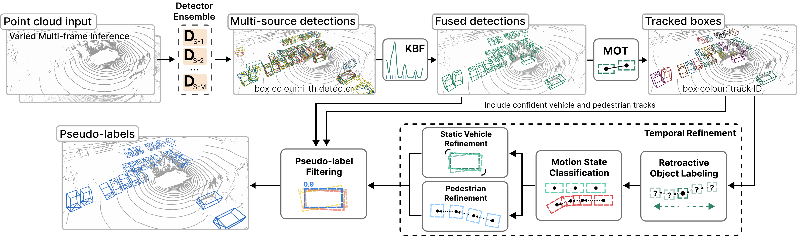
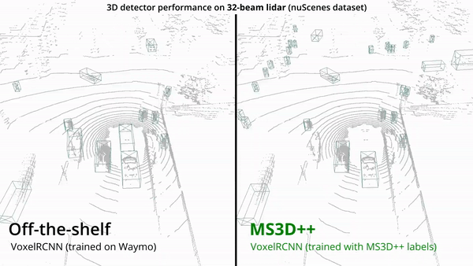

# MS3D and MS3D++
This is the official code release for
- **MS3D**: Leveraging Multiple Detectors for Unsupervised Domain Adaptation in 3D Object Detection [[paper](https://arxiv.org/abs/2304.02431)]
- **MS3D++**: Ensemble of Experts for Multi-Source Unsupervised Domain Adaptation in 3D Object Detection [[paper](https://arxiv.org/abs/2308.05988)] [[presentation](https://youtu.be/gjOgirSks8I?si=i0SMDmqcOrIB2Y49)]

## Introduction
MS3D is a simple **auto-labeling** framework for vehicles and pedestrians that generates high quality labels for training 3D detectors on different lidar types, regardless of their scan pattern or point cloud density. 

To auto-label your own point cloud data, see our [**guide**](docs/AUTO_LABEL_YOUR_DATA.md). To obtain the best results, please use multi-sweep pre-trained models for auto-labeling. Use both dense and sparse lidar pre-trained models in the auto-labeling ensemble for the best chance of generalization.

Get a quick understanding of MS3D with our [**explanation video**](https://youtu.be/7o5F4AMaIWo) and [**tutorial notebook**](tools/demo/ms3d_demo_tutorial.ipynb).


<p align="center">
  
</p>

Our MS3D framework has the following benefits:
- Robust labeling of a **wide range of lidars**. 
- **High performance** of 3D detectors trained with MS3D labels, achieving BEV vehicle detection comparable to training with human-annotated labels.
- **Tailor the ensemble** with any pre-trained 3D detectors to obtain high quality labels on any lidar dataset.
- **Train any 3D detector with any data augmentation**. The final generated labels can replace human-annotated labels in supervised training of any 3D detector and data augmentation.
- Preserves **real-time inference** capability of detectors as we don't modify detector architecture. 
<br/>
<p align="center">
  
</p>
<p align="center">
  
</p>

Our **box fusion method, KBF,** can be used for detector ensembling in a supervised setting as well and can outperform [Weighted Box Fusion (WBF)](https://github.com/ZFTurbo/Weighted-Boxes-Fusion). See our first MS3D paper for comparison results and a simple demo [here](tools/demo/kbf_demo.ipynb).

This main branch is the official release for MS3D++ and is built upon OpenPCDet v0.6.0. If you wish to use our previous MS3D code, please refer to the [MS3D branch](https://github.com/darrenjkt/MS3D/tree/ms3d).

## Overview
1. [Installation](#installation)
2. [Usage: Auto-labeling](#usage-auto-labeling)
3. [Pre-trained Model Zoo](#pre-trained-model-zoo)
4. [UDA Model Zoo](#uda-model-zoo)
5. [Citation](#citation)

## Installation

Please refer to [INSTALL.md](docs/INSTALL.md) for the installation of MS3D.

## Usage: Auto-labeling

We provide the following guides to learn how to use MS3D.
- [GETTING_STARTED.md](docs/GETTING_STARTED.md) to reproduce our paper results. 
- [AUTO_LABEL_YOUR_DATA.md](docs/AUTO_LABEL_YOUR_DATA.md) to auto-label your own point cloud data.
- [PARAMETERS.md](docs/MS3D_PARAMETERS.md) to tune MS3D config file parameters.
- [VISUALIZATION.md](docs/VISUALIZATION.md) to use our visualization tools for label assessment.

We provide a [tutorial](tools/demo/ms3d_demo_tutorial.ipynb) to demonstrate how MS3D auto-labels a folder of point clouds. 

## Pre-trained Model Zoo
In this section, we provide a collection of pre-trained (aka. off-the-shelf) models that can be used to reproduce our results or label your own datasets. If you wish to download multiple detectors, we provide links to download the entire folder of detectors trained on [nuScenes](https://drive.google.com/drive/folders/1hCB5ODFUBqnwwjDO7hdpHq6qgQFaAG72?usp=sharing) and [Lyft](https://drive.google.com/drive/folders/12vVM6WtjG38SjUNhhkgy3ZvkZZDm2Edh?usp=sharing) to save some time.

Reported 3D average precision is the **oracle** performance for the range breakdown 0-30m / 30-50m / 50-80m when trained and tested on the same dataset.

|Source | Detector | Sweeps | Vehicle | Pedestrian | Download |
| ----- | :-----:| :-----:| :--------: | :-----: | :-----: |
| Lyft | [PV-RCNN++ (Anchor)](tools/cfgs/lyft_models/uda_pv_rcnn_plusplus_resnet_anchorhead.yaml) | 1 | 88.9 / 68.2 / 25.0 | 55.1 / 26.8 / 11.9 | [model](https://drive.google.com/file/d/1cgjraUNOaTnargawTHI0-uYHqwA3NgJL/view?usp=sharing) |
| Lyft | [PV-RCNN++ (Center)](tools/cfgs/lyft_models/uda_pv_rcnn_plusplus_resnet_centerhead.yaml) | 1 | 87.1 / 66.2 / 23.6 | 50.0 / 27.7 / 10.5 | [model](https://drive.google.com/file/d/1H6736zF9v4DuHXUmuHDsq3sqG03vXi5T/view?usp=sharing) |
| Lyft | [VoxelRCNN (Anchor)](tools/cfgs/lyft_models/uda_voxel_rcnn_anchorhead.yaml) | 1 | 87.8 / 66.3 / 22.5 | 54.5 / 29.8 / 10.8 | [model](https://drive.google.com/file/d/1Sb5Ik6mTZKhJVXTsi6ilnFZ4n_SMd9L-/view?usp=sharing) |
| Lyft | [VoxelRCNN (Center)](tools/cfgs/lyft_models/uda_voxel_rcnn_centerhead.yaml) | 1 | 88.6 / 66.9 / 22.8 | 52.5 / 27.3 / 11.0 | [model](https://drive.google.com/file/d/1mg71L8tdgBc6uuJTpeS3qqef3zI35KfN/view?usp=sharing) |
| Lyft | [PV-RCNN++ (Anchor)](tools/cfgs/lyft_models/uda_pv_rcnn_plusplus_resnet_anchorhead.yaml) | 3 | 90.3 / 73.3 / 29.0 | 57.0 / 33.4 / 19.2 | [model](https://drive.google.com/file/d/1hMtGI8cK9PMiRVcgYyk3mjqjsHzhvN1B/view?usp=sharing) |
| Lyft | [PV-RCNN++ (Center)](tools/cfgs/lyft_models/uda_pv_rcnn_plusplus_resnet_centerhead.yaml) | 3 | 88.2 / 71.1 / 27.8 | 53.9 / 33.1 / 17.5 | [model](https://drive.google.com/file/d/1kzRGntBYMKETp0425zm-olih2eSg0__W/view?usp=sharing) |
| Lyft | [VoxelRCNN (Anchor)](tools/cfgs/lyft_models/uda_voxel_rcnn_anchorhead.yaml) | 3 | 88.0 /79.7 / 26.2 | 57.8 / 36.6 / 18.9 | [model](https://drive.google.com/file/d/1s2-JPvzq7Vi2ScDD_3JqHqISa5nAiHCq/view?usp=sharing) |
| Lyft | [VoxelRCNN (Center)](tools/cfgs/lyft_models/uda_voxel_rcnn_centerhead.yaml) | 3 | 88.0 / 70.4 / 26.3 | 59.5 / 34.4 / 18.9 | [model](https://drive.google.com/file/d/1Bluez8vYBWC1Eo_9a9k1L1Oigquds843/view?usp=sharing) |
| Lyft | [IA-SSD](tools/cfgs/lyft_models/uda_IA-SSD.yaml) | 3 | 82.6 / 58.7 / 17.6 | 28.9 / 18.9 / 12.2 | [model](https://drive.google.com/file/d/1Gw31JFFUWFd94qqKzEY6zyr0q-x5qim3/view?usp=sharing) |
| nuScenes | [PV-RCNN++ (Anchor)](tools/cfgs/nuscenes_models/uda_pv_rcnn_plusplus_resnet_anchorhead.yaml) | 10| 72.6 / 20.8 / 2.6 | 44.0 / 13.8 / 1.4 | [model](https://drive.google.com/file/d/1G6IdBNOtWiPaoNW_gKdHQnZcFO5Z_cGL/view?usp=sharing) |
| nuScenes | [PV-RCNN++ (Center)](tools/cfgs/nuscenes_models/uda_pv_rcnn_plusplus_resnet_centerhead.yaml) | 10| 68.9 / 18.9 / 2.2 | 42.2 / 14.8 / 1.4 | [model](https://drive.google.com/file/d/1eTODH9OBUPtMcYK1yBY8XRIjexWU-ISV/view?usp=sharing) |
| nuScenes | [VoxelRCNN (Anchor)](tools/cfgs/nuscenes_models/uda_voxel_rcnn_anchorhead.yaml) | 10 | 69.8 / 17.2 / 2.1 | 42.7 / 12.3 / 0.9 | [model](https://drive.google.com/file/d/1KePC1frVhxVnGaotxJNJmH51W0eU8603/view?usp=sharing) |
| nuScenes | [VoxelRCNN (Center)](tools/cfgs/nuscenes_models/uda_voxel_rcnn_centerhead.yaml) | 10| 66.6 / 17.5 / 1.9 | 43.2 / 14.8 / 1.7 | [model](https://drive.google.com/file/d/1J1Sjoyptir-yJQxYv0PsCr20xIDGA7Pf/view?usp=sharing) |
| nuScenes | [IA-SSD](tools/cfgs/nuscenes_models/uda_IA-SSD.yaml) | 10| 57.0 / 10.2 / 0.8 | 31.5 / 8.9 / 0.7 | [model](https://drive.google.com/file/d/1j1oEwfXOdNWElLcMz2mMljGchAMbBrCW/view?usp=sharing) |
| Waymo | [PV-RCNN++ (Anchor)](tools/cfgs/waymo_models/uda_pv_rcnn_plusplus_resnet_anchorhead.yaml) | 1 | 90.2 / 66.4 / 38.8 | 68.3 / 57.2 / 39.0 | - |
| Waymo | [PV-RCNN++ (Center)](tools/cfgs/waymo_models/uda_pv_rcnn_plusplus_resnet_centerhead.yaml) | 1 | 90.6 / 68.2 / 40.1 | 76.6 / 67.6 / 51.2 | - |
| Waymo | [VoxelRCNN (Anchor)](tools/cfgs/waymo_models/uda_voxel_rcnn_anchorhead.yaml) | 1 | 89.9 / 65.3 / 37.0 | 67.9 / 56.2 / 36.1 | - |
| Waymo | [VoxelRCNN (Center)](tools/cfgs/waymo_models/uda_voxel_rcnn_centerhead.yaml) | 1 | 90.2 / 67.9 / 39.3 | 76.0 / 66.8 / 48.8 | - |
| Waymo | [IA-SSD](tools/cfgs/waymo_models/uda_IA-SSD.yaml) | 1 | 86.7 / 59.7 / 31.3 | 60.9 / 55.4 / 42.6 | - |
| Waymo | [PV-RCNN++ (Anchor)](tools/cfgs/waymo_models/uda_pv_rcnn_plusplus_resnet_anchorhead.yaml) | 4 | 90.4 / 68.2 / 40.7 | 67.7 / 56.7 / 37.0 | - |
| Waymo | [PV-RCNN++ (Center)](tools/cfgs/waymo_models/uda_pv_rcnn_plusplus_resnet_centerhead.yaml) | 4 | 91.1 / 70.1 / 42.3 | 75.9 / 68.1 / 53.0 | - |
| Waymo | [VoxelRCNN (Anchor)](tools/cfgs/waymo_models/uda_voxel_rcnn_anchorhead.yaml) | 4 | 90.8 / 69.8 / 43.6 | 68.9 / 61.0 / 46.6 | - |
| Waymo | [VoxelRCNN (Center)](tools/cfgs/waymo_models/uda_voxel_rcnn_centerhead.yaml) | 4 | 91.1 / 71.7 / 45.5 | 78.5 / 71.7 / 60.3 | - |

If you would like to contribute to this table with different models that are trained on different datasets using OpenPCDet, please email me at darrenjktsai@gmail.com with the cfgs/model and I can add it in. Note that the models should be trained with `SHIFT_COOR` for better cross-domain performance.

We do not provide links to Waymo models due to the [Waymo Dataset License Agreement](https://waymo.com/open/terms/). If you would like to have the Waymo pre-trained models, please send me an email with your name, institute, a screenshot of the Waymo dataset registration confirmation mail and your intended usage. Note that we are not allowed to share the model with you if it will use for any profit-oriented activities.

## UDA Model Zoo

In this section we provide the final models after multiple self-training rounds which were used for our paper's results. Average precision results are reported as BEV / 3D with KITTI's evaluation at 40 recall levels.

We also provide the final set of pseudo-labels for each target domain. These can be directly used to train other detectors.

### Target Domain: nuScenes

nuScenes was auto-labeled using an ensemble of Waymo and Lyft pre-trained detectors. The final set of pseudo-labels can be downloaded [here](https://drive.google.com/file/d/1j7XABSc-LcfE8ytoPWkmnjaxLAtVLzAU/view?usp=sharing).

|Method | Detector | Sweeps | Vehicle | Pedestrian | Download |
| ----- | :-----:| :-----:| :--------: | :-----: | :-----: | 
| MS3D | [SECOND-IoU]((tools/cfgs/target_nuscenes/ms3d_waymo_secondiou.yaml)) | 1 | 42.2 / 24.7 | - | [model](https://drive.google.com/file/d/1A3s9IWJFca2pwECHYreWuzvk-bd9UwO-/view?usp=sharing) |
| MS3D++ | [SECOND-IoU](tools/cfgs/target_nuscenes/ms3d_waymo_secondiou.yaml) | 1 | 43.9 / 23.1 | - | [model](https://drive.google.com/file/d/105DTd_J0recMbxy9KLD_gOzWFXc1X6Df/view?usp=sharing) | 
| MS3D | [VoxelRCNN (Center)](tools/cfgs/target_nuscenes/ms3d_waymo_voxel_rcnn_centerhead.yaml) | 10 | 49.2 / 27.5 | - | [model](https://drive.google.com/file/d/1syxMCeC3xoVmINQqwY23AkzYjuf2nUaD/view?usp=sharing) | 
| MS3D++ | [VoxelRCNN (Center)](tools/cfgs/target_nuscenes/ms3d_waymo_voxel_rcnn_centerhead.yaml) | 10 | 50.3 / 27.2 | 25.8 / 15.9 | [model](https://drive.google.com/file/d/1xnNhbp5GTEZznunZrM1yEB3ci8bej8QJ/view?usp=sharing) |
| MS3D++ | [VoxelRCNN (Anchor)](tools/cfgs/target_nuscenes/ms3d_waymo_voxel_rcnn_anchorhead.yaml) | 10 | 52.1 / 26.5 | 27.0 / 15.4 | [model](https://drive.google.com/file/d/1Bqthx1N3IC7MmPbbPM37CO9cw_9zsB7X/view?usp=sharing) | 
| GT-Trained | [VoxelRCNN (Center)](tools/cfgs/target_nuscenes/ms3d_waymo_voxel_rcnn_centerhead.yaml) | 10 | 56.4 / 37.2 | 41.7 / 32.5 | [model](https://drive.google.com/file/d/1de-MFho9by0Z-hjIUx07RPr8Q1zbPNVz/view?usp=sharing) |
| GT-Trained | [VoxelRCNN (Anchor)](tools/cfgs/target_nuscenes/ms3d_waymo_voxel_rcnn_anchorhead.yaml) | 10 | 55.3 / 36.6 | 38.3 / 29.7 | [model](https://drive.google.com/file/d/1LpXvAWKYedn07Efac0BiSRJaFRec3FZV/view?usp=sharing) | 

### Target Domain: Waymo

Waymo was auto-labeled using an ensemble of nuScenes and Lyft pre-trained detectors. The final set of pseudo-labels can be downloaded [here](https://drive.google.com/file/d/1ayt3JDC14X_m59_DwPvlzlMX10OkrFbE/view?usp=sharing).

| Method | Detector | Sweeps | Vehicle | Pedestrian | Download |
| ----- | :-----:| :-----:| :--------: | :-----: | :-----: | 
| MS3D | [VoxelRCNN (Center)](tools/cfgs/target_waymo/ms3d_scratch_voxel_rcnn_centerhead.yaml) | 4 | 64.3 / 47.7 | - | - | 
| MS3D++ | [VoxelRCNN (Center)](tools/cfgs/target_waymo/ms3d_scratch_voxel_rcnn_centerhead.yaml) | 4 | 70.6 / 52.8 | 57.0 / 51.8 | - |
| MS3D++ | [VoxelRCNN (Anchor)](tools/cfgs/target_waymo/ms3d_scratch_voxel_rcnn_anchorhead.yaml) | 4 | 70.3 / 52.3 | 52.7 / 48.9 | - | 
| GT-Trained | [VoxelRCNN (Center)](tools/cfgs/target_waymo/ms3d_scratch_voxel_rcnn_centerhead.yaml) | 4 | 75.1 / 61.2 | 67.8 / 62.9 | - |
| GT-Trained | [VoxelRCNN (Anchor)](tools/cfgs/target_waymo/ms3d_scratch_voxel_rcnn_anchorhead.yaml) | 4 | 73.8 / 60.5 | 57.8 / 54.7 | - | 

As mentioned above regarding Waymo's licensing, email me at darrenjktsai@gmail.com if you wish to download the Waymo models. You can also train these models yourself using our provided cfg files and pseudo-labels.

### Target Domain: Lyft
Lyft was auto-labeled using an ensemble of Waymo and nuScenes pre-trained detectors. The final set of pseudo-labels can be downloaded [here](https://drive.google.com/file/d/1WXm-8PJeUSZa165y5h9EtdKXvIhwD0N_/view?usp=sharing).

|Method | Detector | Sweeps | Vehicle | Pedestrian | Download |
| ----- | :-----:| :-----:| :--------: | :-----: | :-----: | 
| MS3D | [VoxelRCNN (Center)](tools/cfgs/target_lyft/ms3d_waymo_voxel_rcnn_centerhead.yaml) | 3 | 77.3 / 63.4 | - | [model](tools/cfgs/target_lyft/ms3d_waymo_voxel_rcnn_centerhead.yaml) | 
| MS3D++ | [VoxelRCNN (Center)](tools/cfgs/target_lyft/ms3d_waymo_voxel_rcnn_centerhead.yaml) | 3 | 77.0 /66.0 | 46.9 / 43.3 | [model](https://drive.google.com/file/d/1_YU0ODV0DzDby3oWvqMPdqgpdFT2xHcI/view?usp=sharing) |
| MS3D++ | [VoxelRCNN (Anchor)](tools/cfgs/target_lyft/ms3d_waymo_voxel_rcnn_anchorhead.yaml) | 3 | 77.2 / 65.3 | 47.2 / 43.6 | [model](https://drive.google.com/file/d/1I8YEGDP3eLKkm6k9Hc8UJEeWaU2wWY0i/view?usp=sharing) | 
| GT-Trained | [VoxelRCNN (Center)](tools/cfgs/target_lyft/ms3d_waymo_voxel_rcnn_centerhead.yaml) | 3 | 86.8 / 74.7 | 60.6 / 54.2 | [model](https://drive.google.com/file/d/1ttFSM8pGWkpSjuGI9RcCAyconGtH77BP/view?usp=sharing) |
| GT-Trained | [VoxelRCNN (Anchor)](tools/cfgs/target_lyft/ms3d_waymo_voxel_rcnn_anchorhead.yaml) | 3 |85.2 / 72.7 | 58.8 / 50.3 | [model](https://drive.google.com/file/d/1mU3BNQKkIYId35tQA1XaI-ztF5COLO9c/view?usp=sharing) | 


### More qualitative results 
Take a look at more of our visualizations for [MS3D++ qualitative](https://www.youtube.com/watch?v=FhTpUOpm7d8) and [MS3D qualitative](https://www.youtube.com/watch?v=H7SvDm3iBgQ).

## License

MS3D is released under the [Apache 2.0 license](LICENSE).


## Citation
If you find this project useful in your research, please give us a star and consider citing:

```
@article{tsai2023ms3d++,
 title={MS3D++: Ensemble of Experts for Multi-Source Unsupervised Domain Adaptation in 3D Object Detection},
 author={Tsai, Darren and Berrio, Julie Stephany and Shan, Mao and Nebot, Eduardo and Worrall, Stewart},
 journal={arXiv preprint arXiv:2308.05988},
 year={2023}
}
@inproceedings{tsai2023ms3d,
  title={Ms3d: Leveraging multiple detectors for unsupervised domain adaptation in 3d object detection},
  author={Tsai, Darren and Berrio, Julie Stephany and Shan, Mao and Nebot, Eduardo and Worrall, Stewart},
  booktitle={2023 IEEE 26th International Conference on Intelligent Transportation Systems (ITSC)},
  pages={140--147},
  year={2023},
  organization={IEEE}
}
```
