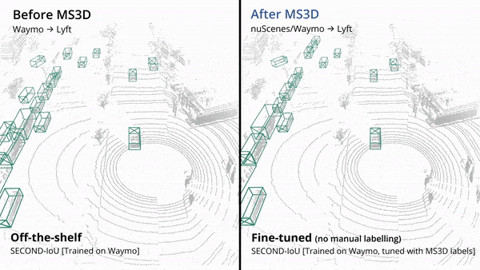

# MS3D
This is the official code release for 
- **MS3D**: Leveraging Multiple Detectors for Unsupervised Domain Adaptation in 3D Object Detection [[Paper](https://arxiv.org/abs/2304.02431)] [[Video](https://youtu.be/4g-NVmz3gj4)]
- **MS3D++**: Ensemble of Experts for Multi-Source Unsupervised Domain Adaption in 3D Object Detection [[Paper](https://arxiv.org/abs/2308.05988)] (code and models will be updated in this repo soon)

MS3D is an **auto-labeling** framework for vehicles and pedestrians that generates high quality labels for training of 3D detectors on a variety of lidars, regardless of their density. Simply using our generated labels for training VoxelRCNN on the Waymo dataset achieves a vehicle detection of 70.3 BEV AP on the official validation dataset, only 3.5 BEV AP less than training with human-annotated labels. Read our papers to find out more.

<p align="center">
  
</p>

MS3D has the following benefits:
- Robust labeling of a **wide range of lidars** such as high and low beam lidars.
- Can **tailor the ensemble** of pre-trained detectors to obtain high auto-labeling quality on any given lidar dataset (e.g. different architectures, source domains, voxel sizes, or class-specific detectors).
- **Compatible with any 3D detector**. MS3D just requires 3D bounding boxes as input so it is compatible with any 3D detector. Generated labels can be used to replace human-annotated labels in supervised training of any 3D detector.
- Preserves **real-time inference** capability of detectors as we don't modify detector architecture. 

Our box fusion method, KBF, can be used for **detector ensembling** in a supervised setting as well and can outperform [Weighted Box Fusion (WBF)](https://github.com/ZFTurbo/Weighted-Boxes-Fusion). See our first MS3D paper for comparison results and a simple demo [here](tools/kbf_demo.ipynb).


## Overview
1. [Installation](#installation)
2. [Getting Started](#getting-started)
3. [Model Zoo](#model-zoo)
4. [Qualitative Results](#qualitative-results)
5. [Citation](#citation)

## Installation

Please refer to [INSTALL.md](docs/INSTALL.md) for the installation of MS3D.

## Usage - Auto-labeling

- Please refer to [DATASET_PREPARATION.md](docs/DATASET_PREPARATION.md) to prepare the datasets. 
- Please refer to [GETTING_STARTED.md](docs/GETTING_STARTED.md) to learn more about how to use MS3D. We are also planning on releasing a guide for custom datasets, stay tuned!
- Please refer to [PARAMETERS.md](docs/PARAMETERS.md) on a guide of how to tune MS3D parameters.
- Please refer to [VISUALIZATION.md](docs/VISUALIZATION.md) to learn how to use our visualization tools.

## Model Zoo
For all tables below, "GT-FT" refers to fine-tuning the pre-trained detector using ground-truth labels from the target domain. Results are reported at IoU=0.7 evaluated at 40 recall levels (R40). Refer to our paper for detailed results.

### Target Domain: nuScenes

Models for target-nuscenes can be downloaded [here](https://drive.google.com/drive/folders/17KYsR6jfNm-erTwN2KvaeicrzUsZ1Vmi?usp=share_link). We also provide MS3D results for fine-tuning with multi-frame detection as is common on nuScenes models to demonstrate that we can further boost performance. All models below use SECOND-IoU.
|Method           | Source | Vehicle (BEV) | Vehicle (3D) | 
| -----           | :-----:| :--------: | :-----: | 
| [MS3D](tools/cfgs/target-nuscenes/ft_waymo_secondiou.yaml)            | Waymo  | 42.23      | 24.76   | 
| [MS3D](tools/cfgs/target-nuscenes/ft_lyft_secondiou.yaml)            | Lyft   | 41.64      | 23.46   | 
| [MS3D (10 frame)](tools/cfgs/target-nuscenes/ft_waymo_secondiou_10frames.yaml) | Waymo  | 47.35      | 27.18   | 
| [GT-FT](tools/cfgs/target-nuscenes/ft_waymo_secondiou.yaml) | Waymo  | 44.39      | 29.46   | 
| [GT-FT (10 frame)](tools/cfgs/target-nuscenes/ft_waymo_secondiou_10frames.yaml) | Waymo  | 50.05      | 33.32   | 

### Target Domain: Lyft
Models for target-lyft can be downloaded [here](https://drive.google.com/drive/folders/1Cpd_OZv9F7_Np2Cdz3CINOnastXyY1y_?usp=share_link). Similarly to nuScenes we show multi-frame detection results for MS3D. All models below use SECOND-IoU.
|Method           | Source | Vehicle (BEV) | Vehicle (3D) | 
| -----           | :-----:| :--------: | :-----: | 
| [SN](tools/cfgs/nuscenes_models/sn_lyft_uda_secondiou.yaml)             | nuScenes  | 63.11      | 39.60   | 
| [SN](tools/cfgs/waymo_models/sn_lyft_uda_secondiou.yaml)          | Waymo  | 71.61      | 56.13   | 
| [ST3D](tools/cfgs/target-lyft/st3d_nuscenes_secondiou.yaml)                                 | nuScenes  | 67.33      | 41.82   | 
| [ST3D](tools/cfgs/target-lyft/st3d_waymo_secondiou.yaml)                                   | Waymo  | 73.86      | 56.33   | 
| [MS3D](tools/cfgs/target-lyft/ft_nuscenes_secondiou.yaml)            | nuScenes   | 75.02      | 59.01   | 
| [MS3D](tools/cfgs/target-lyft/ft_waymo_secondiou.yaml)            | Waymo  | 77.05      | 60.17   | 
| [MS3D (3 frame)](tools/cfgs/target-lyft/ft_waymo_secondiou_multiframe.yaml)            | Waymo  | 76.89      | 63.12   | 
| [GT-FT](tools/cfgs/target-lyft/ft_waymo_secondiou.yaml) | Waymo  | 81.10      | 66.76   |
| [GT-FT (3 frame)](tools/cfgs/target-lyft/ft_waymo_secondiou_multiframe.yaml) | Waymo  | 83.58      | 69.44   | 


### Target Domain: Waymo

Due to the [Waymo Dataset License Agreement](https://waymo.com/open/terms/) we do not provide links to models that are trained on waymo data. You can train your own model using our provided configs.

If you want to download the models, please send me an email with your name, institute, a screenshot of the Waymo dataset registration confirmation mail and your intended usage. Please note that Waymo open dataset is under strict non-commercial license, so we are not allowed to share the model with you if it will use for any profit-oriented activities.

All models below use SECOND-IoU.
|Method           | Source | Vehicle (BEV) | Vehicle (3D) | 
| -----           | :-----:| :--------: | :-----: | 
| [SN](tools/cfgs/lyft_models/sn_waymo_uda_secondiou_vehicle.yaml)              | Lyft  | 53.39      | 39.22   | 
| [SN](tools/cfgs/nuscenes_models/sn_waymo_uda_secondiou_vehicle.yaml)              | nuScenes  | 50.69      | 28.86   | 
| [ST3D](tools/cfgs/target-waymo/st3d_lyft_secondiou.yaml)                                  | Lyft  | 56.06      | 39.17   | 
| [ST3D](tools/cfgs/target-waymo/st3d_nuscenes_secondiou.yaml)                                  | nuScenes  | 55.67      | 28.83   | 
| [MS3D](tools/cfgs/target-waymo/ft_nuscenes_secondiou.yaml)            | Lyft  | 61.25      | 42.88   | 
| [MS3D](tools/cfgs/target-nuscenes/ft_lyft_secondiou.yaml)            | nuScenes   | 61.39      | 42.76   | 
| [GT-FT](tools/cfgs/target-waymo/ft_nuscenes_secondiou.yaml) | Lyft  | 66.76      | 52.50   | 


### Source Models
We provide models trained on source-domain data used in our experiments.

**nuScenes** pre-trained models can be downloaded [here](https://drive.google.com/drive/folders/1hCB5ODFUBqnwwjDO7hdpHq6qgQFaAG72?usp=share_link)

**Lyft** pre-trained models can be downloaded [here](https://drive.google.com/drive/folders/12vVM6WtjG38SjUNhhkgy3ZvkZZDm2Edh?usp=share_link)

For **Waymo**, please send me an email if you would like to download the source-trained models we used.
## Qualitative Results
<p align="center">
  
</p>
<p align="center">
  
</p>
<p align="center">
  
</p>

## License


MS3D is released under the [Apache 2.0 license](LICENSE).


## Citation
If you find this project useful in your research, please give us a star and consider citing:

```
@article{tsai2023ms3d,
  title={MS3D: Leveraging Multiple Detectors for Unsupervised Domain Adaptation in 3D Object Detection},
  author={Tsai, Darren and Berrio, Julie Stephany and Shan, Mao and Nebot, Eduardo and Worrall, Stewart},
  journal={arXiv preprint arXiv:2304.02431},
  year={2023}
}


