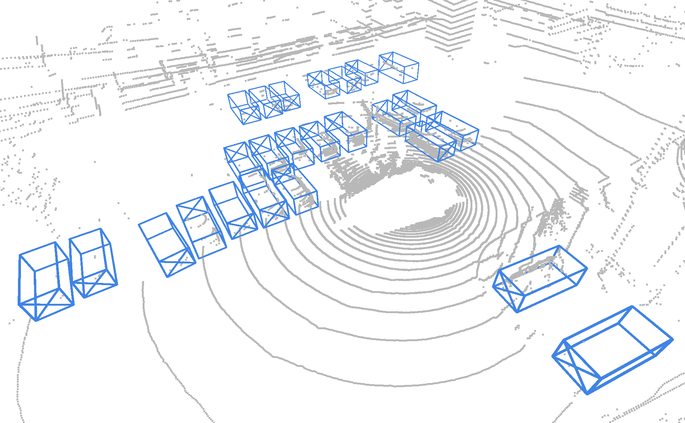
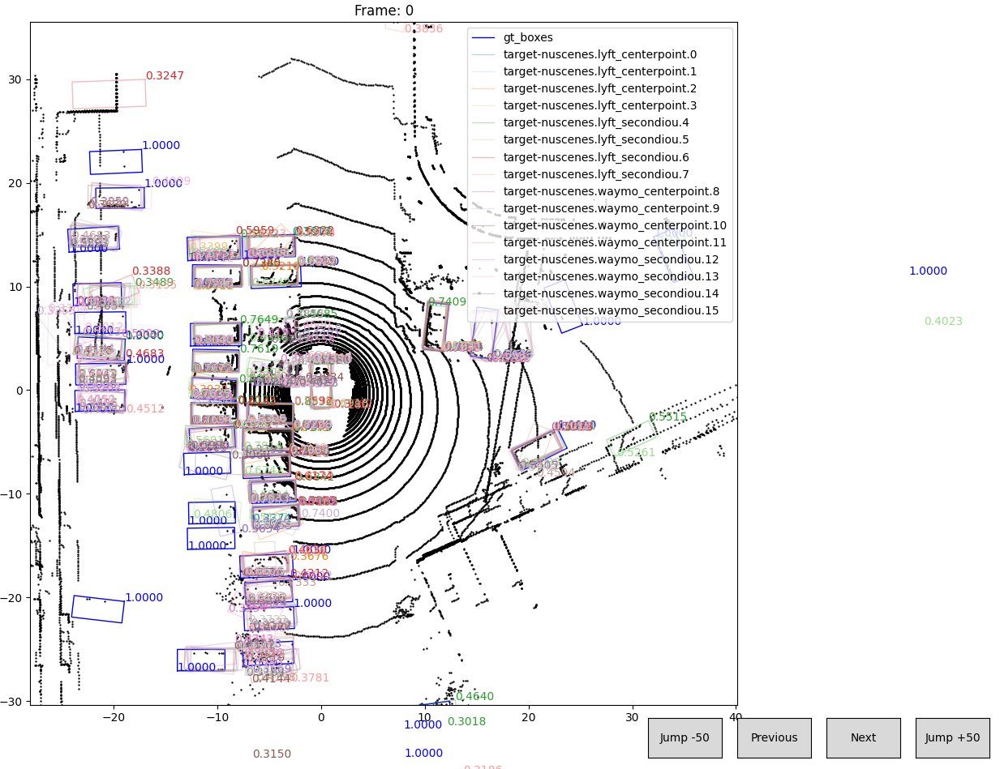

# VISUALIZATION / DEMO

We provide two visualization tools for MS3D: [visualize_3d.py](../tools/visualize_3d.py) and [visualize_bev.py](../tools/visualize_bev.py).

## Visualize 3D

This is the 3D visualization of point clouds with the raw detections or pseudo-labels. This should open up a visualization window. 

```shell
# dets_txt is the txt file containing the paths to detections of pre-trained detectors
python visualize_3d.py --cfg_file cfgs/target-nuscenes/ft_waymo_secondiou.yaml  \
    --idx 6 --dets_txt cfgs/target-nuscenes/raw_dets/det_1f_paths.txt

# ps_pkl is the pseudo-label pkl file from our MS3D pipeline
python visualize_3d.py --cfg_file cfgs/target-nuscenes/ft_waymo_secondiou.yaml \
    --ps_pkl ../output/target-nuscenes/ft_waymo_secondiou/default/ps_label/ps_label_e0.pkl \
    --split train --custom_train_split --idx 6

# Load a detector and visualize its detections
python visualize_3d.py --cfg_file cfgs/target-nuscenes/ft_waymo_secondiou.yaml \
    --ckpt ../output/target-nuscenes/ft_waymo_secondiou/default/ckpt/checkpoint_epoch_30.pth \
    --split train --custom_train_split --idx 6    
```    
<p align="center">
  
</p>

This script is good if you want to visualize one set of detections but is slow when there are too many detections. If you'd like to visualize raw detections from every pre-trained detector, refer to our next section below.

## Visualize BEV
This script visualizes the detections in BEV. This script only visualizes pkl files. We provide an interface to go to the next/previous frames, and to also jump +50 frames ahead or back.

```shell
# txt file containing pkl detections (same as above)
python visualize_bev.py --cfg_file cfgs/target-nuscenes/ft_waymo_secondiou.yaml \
                        --dets_txt /MS3D/tools/cfgs/target-nuscenes/raw_dets/det_1f_paths.txt

# Or you can manually specify multiple pickle paths
python visualize_bev.py --cfg_file cfgs/target-nuscenes/ft_waymo_secondiou.yaml \
  --pkl ../output/target-nuscenes/waymo_centerpoint/ms3d/eval/epoch_no_number/val/nuscenes_customtrain_1f_no_tta/result.pkl \
        ../output/target-nuscenes/waymo_centerpoint/ms3d/eval/epoch_no_number/val/nuscenes_customtrain_1f_tta-rwf/result.pkl                                                         
```
<p align="center">
  
</p>