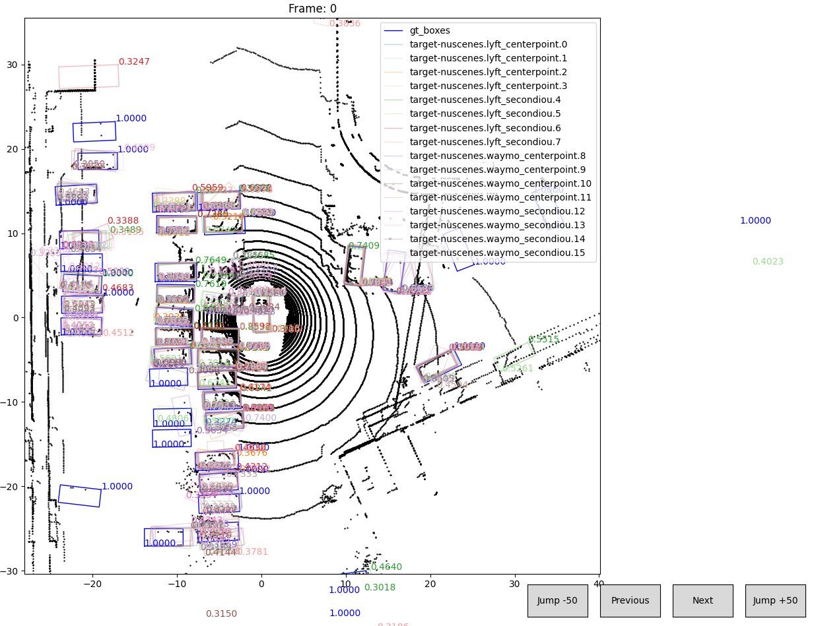
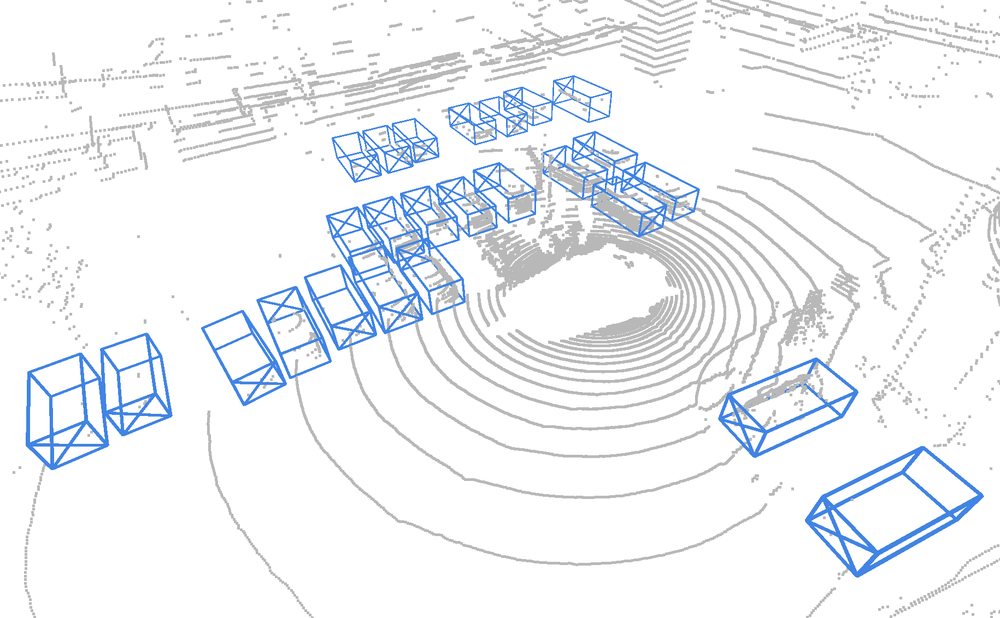

# Visualization Tools

We provide two visualization tools for MS3D: [visualize_bev.py](../tools/visualize_bev.py) and [visualize_3d.py](../tools/visualize_3d.py)

## `visualize_bev.py`
This script visualizes the detections in BEV. We provide an interface to go to the next/previous frames, and to also jump +50 frames ahead or back. This is the primary visual assessment tool we use alongside with camera images for cross-checking.

```shell
# txt file containing pkl detections (same as above)
python visualize_bev.py --cfg_file cfgs/dataset_configs/nuscenes_dataset_da.yaml \
                        --dets_txt /MS3D/tools/cfgs/target_nuscenes/label_generation/round1/cfgs/ensemble_detections.txt

# show the initial_ps_labels.pkl or final_ps_labels.pkl
python visualize_bev.py --cfg_file cfgs/dataset_configs/nuscenes_dataset_da.yaml \
                        --ps_pkl /MS3D/tools/cfgs/target_nuscenes/label_generation/round1/ps_labels/final_ps_dict.pkl                                             
```
<p align="center">
  
</p>

##  `visualize_3d.py`

We also provide a 3D visualization of point clouds together with pseudo-labels, and detection_sets. This also supports loading in a ckpt for inference. It opens up a visualization window. 

```shell
# ps_pkl is the pseudo-label pkl file from our MS3D pipeline
python visualize_3d.py --cfg_file cfgs/dataset_configs/nuscenes_dataset_da.yaml \
    --ps_pkl final_ps_dict.pkl \
    --split train --custom_train_split --idx 6

# Load a detector and visualize its detections. 
# If you want a different target domain, make sure to specify DATA_CONFIG_TAR
python visualize_3d.py --cfg_file ../model_zoo/target_nuscenes/voxel_rcnn_anchorhead_10xyzt_vehped_ms3d++.yaml \
--ckpt ../model_zoo/target_nuscenes/voxel_rcnn_anchorhead_10xyzt_vehped_ms3d++.pth 

# Load a detector, visualize its detections and save each frame as a png
python visualize_3d.py --cfg_file ../model_zoo/target_nuscenes/voxel_rcnn_anchorhead_10xyzt_vehped_ms3d++.yaml \
--ckpt ../model_zoo/target_nuscenes/voxel_rcnn_anchorhead_10xyzt_vehped_ms3d++.pth \
--custom_train_split --save_video --save_video_dir my_video_dir_name
```    
<p align="center">
  
</p>

`visualize_3d.py` is good if you want to visualize one set of detections but is slow when there are too many detections. 
